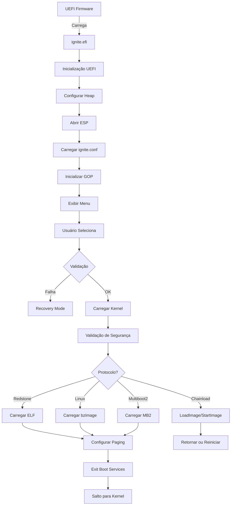

# Ignite Bootloader

<div align="center">


**Bootloader UEFI Industrial de Próxima Geração para Redstone OS**

*Desenvolvido em Rust puro com arquitetura modular, segurança robusta e suporte multi-protocolo*

[🚀 Quick Start](#-quick-start) • [📚 Documentação](#-documentação) • [🏗️ Arquitetura](#️-arquitetura) • [🔒 Segurança](#-segurança) • [🤝 Contribuir](#-contribuir)

</div>

---

## 📖 Visão Geral

**Ignite** é um bootloader UEFI moderno e completo, desenvolvido do zero em Rust para o projeto Redstone OS. Ele substitui bootloaders tradicionais como GRUB, oferecendo uma solução nativa, segura e extensível para sistemas x86_64, com planejamento futuro para AArch64 e RISC-V.

### 🎯 Missão

Fornecer uma camada de inicialização confiável, rápida e segura que:
- **Seja simples de configurar** para usuários finais
- **Seja poderosa o suficiente** para casos de uso avançados
- **Seja segura por padrão** com Secure Boot e TPM
- **Seja extensível** para múltiplos sistemas operacionais

### ✨ Características Principais

#### 🔄 **Suporte Multi-Protocolo**
- **Redstone/Limine**: Protocolo nativo otimizado para kernels modernos
- **Linux Boot Protocol**: Carregamento de kernels Linux (bzImage)
- **Multiboot2**: Compatibilidade com kernels Multiboot2
- **UEFI Chainload**: Execução de outros aplicativos EFI (ex: UEFI Shell)

#### 🛡️ **Segurança Industrial**
- **Secure Boot**: Integração completa com UEFI Secure Boot
- **TPM 2.0**: Medições criptográficas de boot (Trusted Boot)
- **Políticas de Execução**: Controle granular sobre o que pode ser executado
- **Chain of Trust**: Validação de cada componente carregado

#### 🎨 **Interface Gráfica Moderna**
- **GOP (Graphics Output Protocol)**: Suporte nativo a resoluções altas
- **Menu Interativo**: Interface visual com teclado e mouse
- **Temas Customizáveis**: Wallpapers e esquemas de cores
- **Framebuffer Direto**: Acesso de baixo nível para máximo desempenho

#### 💾 **Gerenciamento de Memória Avançado**
- **Alocador Bump**: Alocador personalizado otimizado para boot
- **Paging x86_64**: Configuração completa de tabelas de página
- **Higher-Half Kernel**: Suporte para kernels em espaço virtual superior
- **Memory Map Handoff**: Transferência precisa do mapa de memória para o kernel

#### 📁 **Sistemas de Arquivos**
- **FAT32**: Leitura nativa de partições ESP
- **UEFI Simple FS**: Integração com protocolos UEFI
- **VFS**: Sistema de arquivos virtual para abstração
- **Path Resolution**: Esquemas de URL flexíveis (`boot():/`, `root():/`)

#### 🔧 **Modular e Extensível**
- **14 Módulos Independentes**: Arquitetura limpa e bem organizada
- **APIs Públicas**: Fácil integração e extensão
- **No_std**: Sem dependência da biblioteca padrão
- **Zero Unsafe Desnecessário**: Uso minimal de código unsafe

---

## 🚀 Quick Start

### Pré-requisitos

```bash
# Instalar Rust nightly
rustup toolchain install nightly
rustup default nightly

# Adicionar target x86_64-unknown-uefi
rustup target add x86_64-unknown-uefi

# Ferramentas opcionais para testes
# QEMU para emulação
# OVMF para firmware UEFI
```

### Compilação

```bash
# Clone o repositório
git clone https://github.com/redstone-os/ignite.git
cd ignite

# Build em modo release (recomendado)
cargo build --release --target x86_64-unknown-uefi

# O binário EFI será gerado em:
# target/x86_64-unknown-uefi/release/ignite.efi
```

### Instalação Rápida

```bash
# 1. Monte sua partição ESP (EFI System Partition)
sudo mount /dev/sda1 /mnt/esp

# 2. Crie a estrutura de diretórios
sudo mkdir -p /mnt/esp/EFI/BOOT
sudo mkdir -p /mnt/esp/EFI/ignite

# 3. Copie o bootloader
sudo cp target/x86_64-unknown-uefi/release/ignite.efi /mnt/esp/EFI/BOOT/BOOTX64.EFI

# 4. Copie o kernel e configuração
sudo cp /caminho/para/seu/kernel /mnt/esp/EFI/ignite/forge
sudo cp ignite.conf /mnt/esp/EFI/ignite/

# 5. Desmonte
sudo umount /mnt/esp
```

### Teste em QEMU

```bash
# Executar com OVMF (UEFI firmware)
qemu-system-x86_64 \
  -enable-kvm \
  -m 4G \
  -cpu host \
  -bios /usr/share/ovmf/OVMF.fd \
  -drive file=disk.img,format=raw \
  -serial stdio \
  -display gtk
```

---

## 🏗️ Arquitetura

O Ignite é organizado em módulos altamente coesos e fracamente acoplados:

```
ignite/
├── arch/           # Abstração de arquitetura (x86_64, aarch64, riscv64)
├── config/         # Sistema de configuração (parser, loader)
├── core/           # Tipos centrais, logging, handoff
├── elf/            # Parser e loader de arquivos ELF
├── fs/             # Sistemas de arquivos (FAT32, UEFI, VFS)
├── hardware/       # Drivers de hardware (ACPI, Serial, Storage)
├── memory/         # Gerenciamento de memória (allocator, paging)
├── os/             # Abstração de sistema operacional
├── protos/         # Protocolos de boot (Linux, Multiboot2, Redstone)
├── recovery/       # Sistema de recuperação e diagnósticos
├── security/       # Secure Boot, TPM, políticas de segurança
├── uefi/           # Interface UEFI (boot/runtime services)
├── ui/             # Interface de usuário (menu, tema)
├── video/          # Subsistema de vídeo (GOP, framebuffer)
├── main.rs         # Ponto de entrada (efi_main)
└── lib.rs          # Biblioteca central
```

### Fluxo de Execução



Para informações detalhadas, consulte [docs/ARQUITETURA.md](docs/ARQUITETURA.md).

---

## 📁 Estrutura do Projeto

```
.
├── Cargo.toml              # Manifesto do projeto
├── rust-toolchain.toml     # Configuração da toolchain
├── .clippy.toml            # Configuração do Clippy
├── rustfmt.toml            # Formatação de código
├── src/                    # Código-fonte
│   ├── main.rs            # Entry point
│   ├── lib.rs             # Biblioteca central
│   └── */                 # Módulos (14 subsistemas)
├── docs/                   # Documentação técnica
│   ├── ARQUITETURA.md
│   ├── DESENVOLVIMENTO.md
│   ├── API.md
│   └── ...
├── tests/                  # Testes de integração
└── tools/                  # Ferramentas auxiliares
```

---

## 📚 Documentação

### Guias Principais

- **[Arquitetura e Design](docs/ARQUITETURA.md)** - Visão profunda da arquitetura, módulos e decisões de design
- **[Guia de Desenvolvimento](docs/DESENVOLVIMENTO.md)** - Setup, compilação, debug e workflow
- **[Configuração](docs/CONFIGURACAO.md)** - Formato do ignite.conf e exemplos práticos
- **[Build e Deployment](docs/BUILD.md)** - Processo completo de build, instalação e testes

### Referências Técnicas

- **[Referência de API](docs/API.md)** - Documentação completa de todos os módulos e tipos
- **[Protocolos de Boot](docs/PROTOCOLOS.md)** - Linux, Multiboot2, Redstone/Limine, Chainload
- **[Gerenciamento de Memória](docs/MEMORIA.md)** - Layout, alocação, paging e handoff
- **[Sistemas de Arquivos](docs/FILESYSTEM.md)** - FAT32, UEFI FS, VFS e operações

### Segurança e Operações

- **[Segurança](docs/SEGURANCA.md)** - Secure Boot, TPM, políticas e hardening
- **[Troubleshooting](docs/TROUBLESHOOTING.md)** - Problemas comuns e soluções
- **[Contribuindo](docs/CONTRIBUINDO.md)** - Guia de contribuição e padrões de código

---

## 🔒 Segurança

O Ignite foi projetado com segurança em mente desde o início:

- ✅ **Secure Boot Ready**: Validação de assinaturas digitais
- ✅ **TPM 2.0 Support**: Medições em PCRs para Trusted Boot
- ✅ **Memory Safety**: Rust elimina classes inteiras de vulnerabilidades
- ✅ **Minimal Unsafe**: Uso criterioso de código unsafe apenas onde necessário
- ✅ **Políticas Configuráveis**: Controle fino sobre o que pode executar
- ✅ **Chain of Trust**: Cada componente valida o próximo

Para mais detalhes, consulte [docs/SEGURANCA.md](docs/SEGURANCA.md).

---

## 🛠️ Tecnologias Utilizadas

- **[Rust](https://www.rust-lang.org/)** - Linguagem de sistemas segura e performática
- **[UEFI](https://uefi.org/)** - Unified Extensible Firmware Interface 2.10
- **[goblin](https://github.com/m4b/goblin)** - Parser de binários ELF/PE
- **[bitflags](https://github.com/bitflags/bitflags)** - Manipulação de flags
- **Custom UEFI bindings** - Implementação própria de FFI UEFI

---

## 🤝 Contribuir

Contribuições são bem-vindas! Veja nosso [Guia de Contribuição](docs/CONTRIBUINDO.md) para:

- Como configurar o ambiente de desenvolvimento
- Padrões de código e estilo
- Processo de pull request
- Áreas que precisam de ajuda

### Issues e Sugestões

- 🐛 **Bugs**: [Reportar bug](https://github.com/redstone-os/ignite/issues/new?template=bug_report.md)
- 💡 **Features**: [Sugerir feature](https://github.com/redstone-os/ignite/issues/new?template=feature_request.md)
- 📖 **Documentação**: Melhorias sempre são bem-vindas

---

## 📊 Status do Projeto

| Componente | Status | Descrição |
|------------|--------|-----------|
| Boot x86_64 | ✅ Completo | Boot funcional em QEMU e hardware |
| Protocolo Redstone | ✅ Completo | ELF loader e handoff |
| Protocolo Linux | 🚧 Em Progresso | bzImage parser implementado |
| Protocolo Multiboot2 | 🚧 Em Progresso | Estruturas básicas |
| Chainload UEFI | ✅ Completo | LoadImage/StartImage |
| Secure Boot | ✅ Completo | Detecção e validação |
| TPM | ✅ Completo | Medições em PCRs |
| GOP/Framebuffer | ✅ Completo | Resoluções até 4K |
| Menu Gráfico | ✅ Completo | Teclado e mouse |
| FAT32 | ✅ Completo | Leitura de ESP |
| AArch64 | 📋 Planejado | Suporte ARM64 |
| RISC-V | 📋 Planejado | Suporte RISC-V 64 |

---

## 📜 Licença

Este projeto está licenciado sob a Licença MIT - veja o arquivo [LICENSE](LICENSE) para detalhes.

---

## 🙏 Agradecimentos

- **Redstone OS Team** - Desenvolvimento e manutenção
- **Rust Community** - Ferramentas e suporte
- **UEFI Forum** - Especificações técnicas
- **Limine Project** - Inspiração para o protocolo nativo

---

## 📞 Contato

- **Website**: https://redstone-os.org
- **GitHub**: https://github.com/redstone-os/ignite
- **Discord**: https://discord.gg/redstone-os

---

<div align="center">

**Feito com ❤️ e Rust** 🦀

*Bootloader do Futuro, Hoje*

</div>
