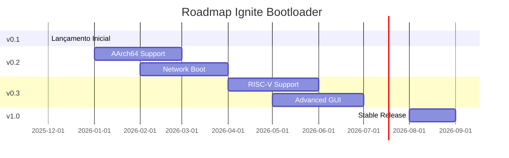

# Roadmap - Ignite Bootloader

Planejamento de desenvolvimento e evolução do Ignite.

---

## 🎯 Visão Geral

O Ignite visa ser o **bootloader UEFI mais moderno, seguro e extensível**, escrito em Rust, para sistemas operacionais de próxima geração.

### Objetivos de Longo Prazo

1. 🌐 **Multi-arquitetura**: x86_64, AArch64, RISC-V
2. 🔒 **Segurança máxima**: Verified Boot, FDE completo
3. ⚡ **Performance**: Boot < 100ms
4. 🎨 **User Experience**: GUI moderna e responsiva
5. 🔌 **Extensibilidade**: Plugin system robusto

---

## 📅 Timeline

---

## 🚀 Versão 0.2.0 - "Network" (Q1 2026)

**Foco**: Expansão de arquiteturas e boot remoto

### Features Planejadas

#### 🖥️ AArch64 Support (ARM64)
- [ ] Port completo para ARM64
- [ ] ACPI support (FADT, MADT)
- [ ] Device Tree support
- [ ] Raspberry Pi 4 target
- [ ] Apple Silicon boot (experimental)

**Prioridade**: 🔴 ALTA  
**Estimativa**: 8 semanas  
**Dependências**: Nenhuma

#### 🌐 Network Boot (PXE/HTTP)
- [ ] PXE (Preboot Execution Environment)
- [ ] HTTP boot (UEFI HTTP Boot)
- [ ] TFTP fallback
- [ ] Network configuration (DHCP)
- [ ] Download com progress
- [ ] Verificação de checksums
- [ ] Cache de arquivos baixados

**Prioridade**: 🟡 MÉDIA  
**Estimativa**: 6 semanas  
**Dependências**: Network stack

#### 🔐 Verified Boot
- [ ] Kernel signature verification
- [ ] Chain of trust completo
- [ ] Integration com Secure Boot DB
- [ ] Custom certificate store
- [ ] Revocation lists
- [ ] Audit logging

**Prioridade**: 🔴 ALTA  
**Estimativa**: 4 semanas  
**Dependências**: Crypto libs

#### 📦 Melhorias em Protocolos
- [ ] Multiboot2: Suporte completo a todas tags
- [ ] Linux: Suporte a kernels muito antigos
- [ ] Redstone: Extensões customizadas
- [ ] Novo protocolo: Zephyr RTOS

**Prioridade**: 🟢 BAIXA  
**Estimativa**: 3 semanas

### Otimizações
- [ ] Parallel file loading
- [ ] Lazy module loading
- [ ] Compressed kernel support (gz, xz, zstd)
- [ ] Boot time < 300ms

### Documentação
- [ ] Tradução para inglês
- [ ] AArch64 porting guide
- [ ] Network boot tutorial
- [ ] Video tutorials

---

## 🎨 Versão 0.3.0 - "Experience" (Q2 2026)

**Foco**: User Experience e RISC-V

### Features Planejadas

#### 🖼️ Advanced GUI
- [ ] Mouse support (GOP pointer)
- [ ] Touch screen support
- [ ] Animações suaves
- [ ] Dual monitor support
- [ ] Custom themes (JSON)
- [ ] Wallpaper support (PNG/JPEG)
- [ ] Icon rendering
- [ ] Progress bars visuais
- [ ] Splash screen

**Prioridade**: 🟡 MÉDIA  
**Estimativa**: 6 semanas

#### 🔧 RISC-V 64 Support
- [ ] Port completo para RISC-V
- [ ] SBI (Supervisor Binary Interface)
- [ ] Device Tree parsing
- [ ] QEMU virt machine
- [ ] SiFive boards
- [ ] StarFive VisionFive 2

**Prioridade**: 🟡 MÉDIA  
**Estimativa**: 8 semanas

#### 💾 Filesystem Enhancements
- [ ] ext4 read support
- [ ] Btrfs read support (experimental)
- [ ] NTFS read support
- [ ] ISO9660 (El Torito)
- [ ] FAT32 write support
- [ ] Filesystem caching

**Prioridade**: 🟢 BAIXA  
**Estimativa**: 4 semanas

#### 🔒 Full Disk Encryption
- [ ] LUKS2 support
- [ ] Password prompt UI
- [ ] TPM unsealing
- [ ] USB key unlock
- [ ] Emergency passphrase

**Prioridade**: 🔴 ALTA  
**Estimativa**: 5 semanas  
**Dependências**: Crypto libs

### Otimizações
- [ ] GPU acceleration (experimental)
- [ ] Multi-threaded loading
- [ ] Boot time < 200ms

---

## 🎯 Versão 1.0.0 - "Stable" (Q3 2026)

**Foco**: Estabilidade, polimento e produção

### Objetivos

#### 🏆 Production Ready
- [ ] Zero known critical bugs
- [ ] 95%+ test coverage
- [ ] External security audit
- [ ] Formal verification (componentes críticos)
- [ ] Compliance certifications
- [ ] Long-term support (LTS)

#### 📚 Documentation Excellence
- [ ] Complete API documentation
- [ ] Developer handbook
- [ ] Deployment guide
- [ ] Troubleshooting encyclopedia
- [ ] Case studies
- [ ] White papers

#### 🔐 Security Hardening
- [ ] Fuzzing campaign completa
- [ ] Static analysis (MIRI)
- [ ] Memory sanitizers
- [ ] Penetration testing
- [ ] Bug bounty program

#### ⚡ Performance
- [ ] Boot time < 100ms (target)
- [ ] Memory usage < 2MB
- [ ] Binary size < 200KB

---

## 🔮 Versão 2.0.0 - "Future" (2027+)

**Visão de longo prazo**

### Features Visionárias

#### 🤖 AI-Assisted Boot
- [ ] Predictive boot failure detection
- [ ] Automatic recovery suggestions
- [ ] Smart configuration tuning
- [ ] Anomaly detection

#### 🔌 Plugin System
- [ ] Dynamic plugin loading
- [ ] Plugin marketplace
- [ ] Community extensions
- [ ] Sandboxed execution

#### 🌍 Universal Boot
- [ ] Boot de qualquer mídia
- [ ] Cloud boot
- [ ] Container boot
- [ ] Virtualization-aware

#### 📱 Mobile Support
- [ ] Android boot (experimental)
- [ ] iOS support (se viável)
- [ ] Embedded devices

#### 🎮 Gaming Console Boot
- [ ] PlayStation (homebrew)
- [ ] Xbox (dev mode)
- [ ] Nintendo Switch

---

## 🛠️ Backlog Permanente

### Manutenção Contínua
- Atualização de dependências
- Correção de bugs
- Otimizações incrementais
- Documentação updates
- Security patches

### Melhorias Incrementais
- Refatorações
- Code quality
- Test coverage
- Performance tuning

---

## 📊 Métricas de Sucesso

### v0.2.0
- [ ] 3+ arquiteturas suportadas
- [ ] Network boot funcional
- [ ] 5.000+ downloads
- [ ] 50+ stars no GitHub

### v0.3.0
- [ ] GUI 100% funcional
- [ ] 2+ filesystems suportados
- [ ] 10.000+ downloads
- [ ] 100+ stars no GitHub

### v1.0.0
- [ ] Production deployments: 100+
- [ ] Zero critical bugs
- [ ] 95%+ test coverage
- [ ] External audit passed
- [ ] 500+ stars no GitHub

### v2.0.0
- [ ] 10+ plugins disponíveis
- [ ] 50.000+ downloads
- [ ] Enterprise adoption
- [ ] 1.000+ stars no GitHub

---

## 🤝 Como Contribuir

Veja áreas prioritárias em [CONTRIBUINDO.md](docs/CONTRIBUINDO.md).

### High-Impact Areas
1. 🔴 **AArch64 port** - Crítico para expansão
2. 🔴 **Verified Boot** - Crítico para segurança
3. 🟡 **Network boot** - Alta demanda
4. 🟡 **GUI improvements** - UX importante

### Good First Issues
- 🟢 Theme customization
- 🟢 Additional filesystem support
- 🟢 Documentation translation
- 🟢 Example configurations

---

## 📞 Feedback

Seu feedback é importante! Compartilhe suas ideias:

- 💬 **Discussions**: GitHub Discussions
- 🐛 **Issues**: GitHub Issues
- 📧 **Email**: feedback@redstone-os.org

---

## 🔄 Atualizações

Este roadmap é revisado **mensalmente** e atualizado conforme:
- Feedback da comunidade
- Mudanças tecnológicas
- Prioridades do projeto
- Recursos disponíveis

**Última atualização**: 2025-12-21  
**Próxima revisão**: 2026-01-21

---

**Nota**: Datas e features podem mudar. Este é um roadmap vivo e será ajustado conforme necessário.

🚀 **Vamos construir o futuro do boot juntos!**
