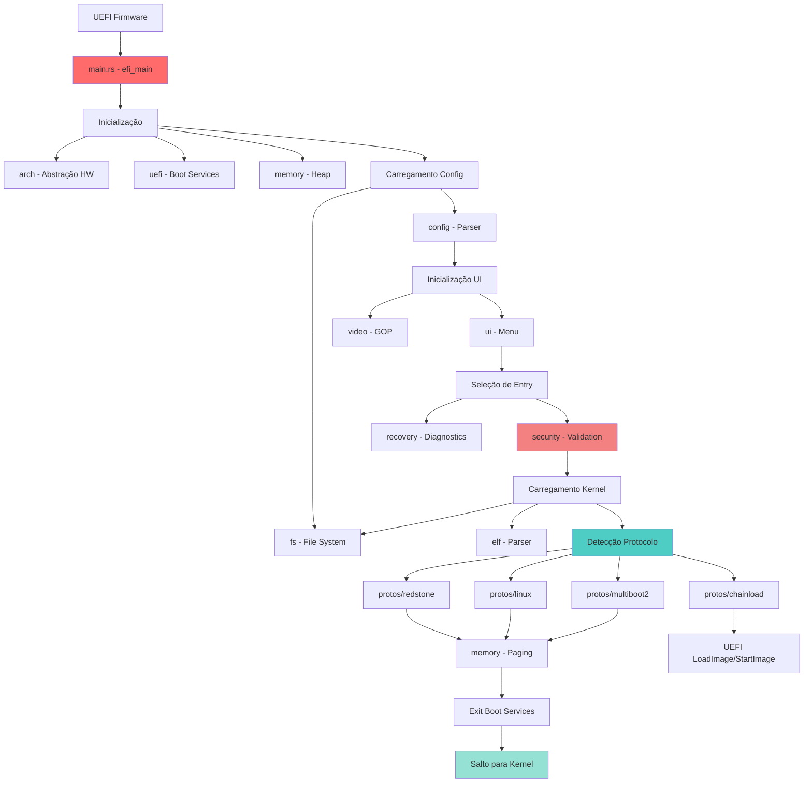
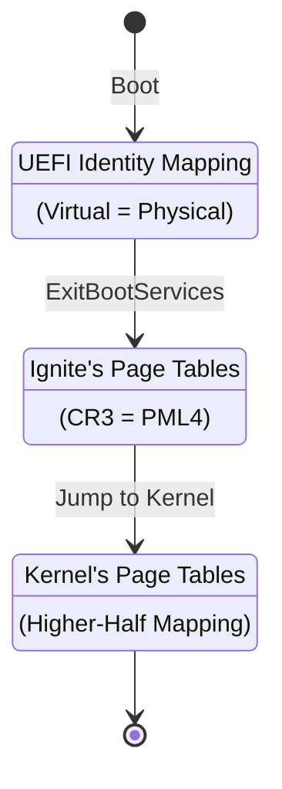
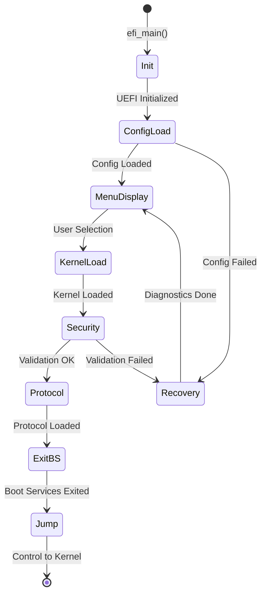

# Arquitetura do Ignite Bootloader

## 📋 Índice

- [Visão Geral](#visão-geral)
- [Princípios de Design](#princípios-de-design)
- [Arquitetura de Módulos](#arquitetura-de-módulos)
- [Fluxo de Execução Detalhado](#fluxo-de-execução-detalhado)
- [Modelo de Memória](#modelo-de-memória)
- [Gerenciamento de Estado](#gerenciamento-de-estado)
- [Protocolos e Interfaces](#protocolos-e-interfaces)
- [Decisões de Design](#decisões-de-design)

---

## Visão Geral

O **Ignite** é um bootloader UEFI modular desenvolvido em Rust que segue uma arquitetura em camadas, separando responsabilidades entre 14 módulos principais. A arquitetura foi projetada para:

- **Modularidade**: Cada subsistema é independente e reutilizável
- **Testabilidade**: Módulos podem ser testados isoladamente
- **Extensibilidade**: Novos protocolos e features podem ser adicionados facilmente
- **Segurança**: Separação clara entre código confiável e não-confiável
- **Manutenibilidade**: Código organizado logicamente facilita manutenção

### Diagrama de Alto Nível



---

## Princípios de Design

### 1. **No_std e Bare Metal**

O Ignite não depende da biblioteca padrão do Rust (`std`), operando em ambiente bare-metal com apenas a biblioteca `core` e `alloc`:

```rust
#![no_std]
#![no_main]
```

**Implicações**:
- Controle total sobre alocação de memória
- Binário extremamente compacto (~200-300 KB)
- Sem overhead de runtime desnecessário
- Inicialização ultra-rápida

### 2. **Arquitetura em Camadas**

```
┌─────────────────────────────────────┐
│     Application Layer (main.rs)     │  <- Orquestração
├─────────────────────────────────────┤
│  Protocol Layer (protos)            │  <- Lógica de boot
├─────────────────────────────────────┤
│  Service Layer (ui, fs, security)   │  <- Serviços de alto nível
├─────────────────────────────────────┤
│  Core Layer (memory, elf, video)    │  <- Primitivas essenciais
├─────────────────────────────────────┤
│  Platform Layer (uefi, arch)        │  <- Abstração de hardware
├─────────────────────────────────────┤
│        Hardware / UEFI Firmware     │
└─────────────────────────────────────┘
```

### 3. **Separação de Responsabilidades**

Cada módulo tem uma responsabilidade única e bem definida:

| Módulo | Responsabilidade | Dependências Principais |
|--------|------------------|------------------------|
| `arch` | Abstração de arquitetura | `core` |
| `uefi` | Interface UEFI FFI | `core` |
| `memory` | Gerenciamento de memória | `uefi`, `arch` |
| `fs` | Sistemas de arquivos | `uefi`, `alloc` |
| `config` | Configuração do bootloader | `fs`, `alloc` |
| `elf` | Parsing de binários ELF | `core`, `goblin` |
| `video` | Gráficos e framebuffer | `uefi` |
| `ui` | Interface de usuário | `video`, `config` |
| `security` | Validação e medição | `uefi` |
| `protos` | Protocolos de boot | `elf`, `memory` |
| `recovery` | Diagnósticos e recovery | `fs`, `config` |

### 4. **Trait-Based Abstraction**

Uso extensivo de traits para abstrair implementações:

```rust
// Abstração de alocador de memória
pub trait FrameAllocator {
    fn allocate_frame(&mut self, count: usize) -> Result<u64>;
    fn free_frame(&mut self, addr: u64, count: usize) -> Result<()>;
}

// Abstração de sistema de arquivos
pub trait FileSystem {
    fn root(&mut self) -> Result<Box<dyn DirectoryHandle>>;
    fn open(&mut self, path: &str) -> Result<Box<dyn FileHandle>>;
}

// Abstração de protocolo de boot
pub trait BootProtocol {
    fn name(&self) -> &str;
    fn identify(&self, data: &[u8]) -> bool;
    fn load(&mut self, data: &[u8], cmdline: Option<&str>, modules: Vec<LoadedFile>) 
        -> Result<KernelLaunchInfo>;
}
```

---

## Arquitetura de Módulos

### **1. arch - Abstração de Arquitetura**

**Localização**: `src/arch/`

**Propósito**: Isola código específico de arquitetura, permitindo portabilidade.

**Estrutura**:
```bash
arch/
├── mod.rs               # Seleção de arquitetura (x86_64 padrão)
├── x86/                 # Implementação x86_64
│   ├── mod.rs
│   ├── io.rs            # Port I/O (in/out)
│   ├── instructions.rs  # CLI, STI, HLT, etc
│   ├── registers.rs     # CR0, CR3, CR4, MSRs
│   └── serial.rs        # COM1 para debug
├── aarch64.rs           # Stub para ARM64 (futuro)
└── riscv64.rs           # Stub para RISC-V (futuro)
```

**Funcionalidades**:
- Port I/O para serial (COM1)
- Instruções privilegiadas (CLI, STI, HLT)
- Acesso a registradores de controle (CR3 para paging)
- Logging serial para debugging

**Exemplo de Uso**:
```rust
use ignite::arch::x86;

// Inicializar hardware específico
unsafe {
    x86::init();  // Configura COM1
}

// Escrever na porta serial
ignite::println!("Debug message via COM1");
```

---

### **2. uefi - Interface UEFI**

**Localização**: `src/uefi/`

**Propósito**: Implementação pura de FFI (Foreign Function Interface) para UEFI sem bibliotecas externas.

**Estrutura**:
```bash
uefi/
├── mod.rs               # Tipos globais (Handle, Status, Guid)
├── table/               # Tabelas UEFI
│   ├── mod.rs
│   ├── system.rs        # SystemTable (ponto de entrada)
│   ├── boot.rs          # BootServices (alocação, protocolos)
│   ├── runtime.rs       # RuntimeServices (variáveis NVRAM, reset)
│   ├── header.rs        # TableHeader (comum a todas)
│   └── config.rs        # GUIDs de configuração (ACPI, SMBIOS)
└── proto/               # Protocolos UEFI
    ├── mod.rs
    ├── loaded_image.rs  # Informações da imagem carregada
    ├── media/
    │   └── fs.rs        # SimpleFileSystem, File Protocol
    └── console/
        ├── text.rs      # SimpleTextInput/Output
        └── gop.rs       # Graphics Output Protocol
```

**Detalhes de Implementação**:

#### Boot Services
```rust
#[repr(C)]
pub struct BootServices {
    pub hdr: TableHeader,
    // ... ponteiros de função com sufixo _f para evitar colisão
    pub allocate_pool_f: extern "efiapi" fn(...) -> Status,
    pub free_pool_f: extern "efiapi" fn(...) -> Status,
    pub get_memory_map_f: extern "efiapi" fn(...) -> Status,
    pub exit_boot_services_f: extern "efiapi" fn(...) -> Status,
    // ...
}

impl BootServices {
    // Wrappers seguros
    pub fn allocate_pool(&self, ty: MemoryType, size: usize) 
        -> Result<*mut u8> {
        let mut buffer = core::ptr::null_mut();
        let status = unsafe { 
            (self.allocate_pool_f)(ty, size, &mut buffer) 
        };
        status.to_result().map(|_| buffer)
    }
}
```

**Por que implementação própria?**
- Controle total sobre ABI e calling conventions
- Binário menor (sem abstração excessiva)
- Aprendizado profundo de UEFI
- Flexibilidade para otimizações customizadas

---

### **3. memory - Gerenciamento de Memória**

**Localização**: `src/memory/`

**Propósito**: Abstração completa de alocação e paging.

**Estrutura**:
```bash
memory/
├── mod.rs              # Re-exports e tipos principais
├── allocator.rs        # Trait FrameAllocator
├── bump_allocator.rs   # Heap allocator (BumpAllocator)
├── layout.rs           # Constantes de layout de memória
├── map.rs              # UefiMemoryMap parser
├── paging.rs           # Page Table Manager (x86_64)
├── region.rs           # PhysicalMemoryRegion abstraction
└── handoff.rs          # Memory Map para kernel
```

**Componentes-Chave**:

#### Bump Allocator
Alocador sequencial otimizado para boot (sem free):
```rust
pub struct BumpAllocator {
    heap_start: AtomicUsize,
    heap_end: AtomicUsize,
    next: AtomicUsize,
}
```

**Características**:
- O(1) allocation
- Thread-safe via atomics
- Sem fragmentation (não suporta free individual)
- Perfeito para ambiente de boot

#### Page Table Manager
Gerencia paging x86_64 (4 níveis):
```rust
pub struct PageTableManager {
    pml4_phys_addr: u64,
}

impl PageTableManager {
    pub fn new(allocator: &mut impl FrameAllocator) -> Result<Self>;
    pub fn identity_map(&mut self, phys: u64, count: usize) -> Result<()>;
    pub fn map_kernel(&mut self, phys: u64, virt: u64, pages: usize) -> Result<()>;
    pub fn pml4_addr(&self) -> u64;  // Para carregar em CR3
}
```

**Formato de Entrada de Página**:
```plaintext
Bits  63   52     51    12   11   8  7  6  5  4  3  2  1  0
     [NX] [AVL] [Addr] [AVL] [G] [PS] [D] [A] [PC] [W] [U] [P]

NX  = No Execute
PS  = Page Size (0=4K, 1=2M/1G)
W   = Writable
P   = Present
```

---

### **4. fs - Sistemas de Arquivos**

**Localização**: `src/fs/`

**Propósito**: Abstração de filesystem para ler configuração e kernel.

**Estrutura**:
```bash
fs/
├── mod.rs          # Traits FileSystem, FileHandle, DirectoryHandle
├── uefi.rs         # UefiFileSystem (wrapper para SimpleFileSystem)
├── fat32.rs        # Driver FAT32 nativo (leitura)
├── redstonefs.rs   # Futuro: FS proprietário
├── vfs.rs          # Virtual File System (montagem de múltiplos FS)
├── path.rs         # Path resolution (boot():/, root():/)
├── loader.rs       # Helpers para carregar arquivos
└── dev.rs          # Dispositivos especiais (null, zero)
```

**Exemplo de Uso**:
```rust
let mut fs = UefiFileSystem::new(simple_fs_proto);
let mut root = fs.root()?;
let mut file = root.open_file("EFI/ignite/ignite.conf")?;
let data = ignite::fs::read_to_bytes(file.as_mut())?;
```

**Path Resolution**:
- `boot():/path` → ESP (EFI System Partition)
- `root():/path` → Raiz do sistema (após mount)
- `/absolute/path` → Relativo ao FS atual

---

### **5. config - Configuração**

**Localização**: `src/config/`

**Propósito**: Parser e loader do arquivo `ignite.conf`.

**Estrutura**:
```bash
config/
├── mod.rs      # Re-exports
├── types.rs    # BootConfig, Entry, Protocol, Module
├── parser.rs   # Parser de texto do ignite.conf
├── loader.rs   # Carrega do disco via FS
├── path.rs     # Resolução de caminhos especiais
└── macros.rs   # Macros auxiliares
```

**Formato do arquivo (ignite.conf)**:
```ini
# Configurações Globais
timeout = 5
default = 0
resolution = 1920x1080

# Entrada 1: Redstone OS
[[entry]]
name = "Redstone OS"
protocol = "redstone"
path = "boot():/EFI/ignite/forge"
cmdline = "--verbose"

# Entrada 2: UEFI Shell
[[entry]]
name = "UEFI Shell"
protocol = "chainload"
path = "boot():/EFI/BOOT/shellx64.efi"
```

**Parsing**:
- Custom parser (não usa TOML libs para reduzir tamanho)
- Suporta comentários (`#`)
- Valores tipados (int, bool, string, array)
- Validação de campos obrigatórios

---

### **6. elf - Parser ELF**

**Localização**: `src/elf/`

**Propósito**: Carregar binários ELF64 (formato padrão para kernels Unix-like).

**Estrutura**:
```bash
elf/
├── mod.rs      # Re-exports
├── header.rs   # Parsing de ElfHeader, ProgramHeader
└── loader.rs   # Carrega ELF na memória e configura paging
```

**Fluxo de Carregamento**:
1. **Validação**: Magic number `0x7F ELF`
2. **Parsing**: Ler headers (ELF Header + Program Headers)
3. **Alocação**: Alocar frames para cada segmento PT_LOAD
4. **Cópia**: Copiar dados do arquivo para memória física
5. **Mapeamento**: Mapear segmentos no espaço virtual do kernel
6. **Entry Point**: Retornar endereço de entrada (`e_entry`)

**Exemplo de Uso**:
```rust
let elf = ElfLoader::new(&kernel_data)?;
let entry = elf.entry_point();
let load_segments = elf.load_segments(allocator, page_table)?;
```

---

### **7. video - Subsistema de Vídeo**

**Localização**: `src/video/`

**Propósito**: Gráficos via UEFI GOP (Graphics Output Protocol).

**Estrutura**:
```bash
video/
├── mod.rs          # init_video(), API principal
├── gop.rs          # Driver GOP (acesso ao protocolo UEFI)
├── framebuffer.rs  # Abstração de framebuffer linear
├── pixel.rs        # Formatos de pixel (RGB, BGR, Bitmask)
└── mode.rs         # Modos de vídeo (resoluções)
```

**Framebuffer**:
```rust
pub struct FramebufferInfo {
    pub addr: u64,       // Endereço físico do VRAM
    pub size: usize,     // Tamanho total em bytes
    pub width: u32,      // Largura em pixels
    pub height: u32,     // Altura em pixels
    pub stride: u32,     // Pixels por linha (pode ser > width)
    pub format: PixelFormat,
}
```

**Operações Básicas**:
```rust
// Desenhar pixel
fn draw_pixel(fb: &mut [u8], x: u32, y: u32, stride: u32, color: Pixel);

// Preencher retângulo
fn fill_rect(fb: &mut [u8], x: u32, y: u32, w: u32, h: u32, color: Pixel);

// Blit buffer
fn blit(fb: &mut [u8], src: &[u8], x: u32, y: u32, w: u32, h: u32);
```

---

### **8. ui - Interface de Usuário**

**Localização**: `src/ui/`

**Propósito**: Menu gráfico interativo.

**Estrutura**:
```bash
ui/
├── mod.rs       # Re-exports
├── menu.rs      # Menu principal (renderização e input)
├── font.rs      # Font rendering (bitmap PSF)
├── graphics.rs  # Primitivas gráficas (linhas, retângulos)
├── input.rs     # Tratamento de teclado (SimpleTextInput)
└── theme.rs     # Cores e estilo visual
```

**Componentes do Menu**:
1. **Header**: Logo/título do bootloader
2. **Entry List**: Opções de boot
3. **Footer**: Instruções (↑↓ para navegar, Enter para selecionar)
4. **Timeout Indicator**: Contagem regressiva

**Interação**:
- Teclas ↑↓: Navegar entre entradas
- Enter: Selecionar
- Esc: Entrar em recovery mode
- F2: Configurações (futuro)

---

### **9. security - Segurança**

**Localização**: `src/security/`

**Propósito**: Validação e medição de componentes de boot.

**Estrutura**:
```bash
security/
├── mod.rs          # validate_and_measure()
├── secure_boot.rs  # Detecção e enforcement de Secure Boot
├── tpm.rs          # Interface TPM 2.0 (medições)
└── policy.rs       # SecurityPolicy (ações em caso de falha)
```

**Secure Boot**:
```rust
pub enum SecureBootState {
    Enabled,     // Secure Boot ativo
    Disabled,    // Desabilitado nas configurações UEFI
    SetupMode,   // Modo de configuração (sem chaves)
}

pub fn get_state() -> SecureBootState;
pub fn enforcement_required() -> bool;
```

**TPM (Trusted Platform Module)**:
```rust
// Medir binário em um PCR (Platform Configuration Register)
pub fn measure_binary(data: &[u8], pcr: u32, description: &str) -> Result<()>;

// PCRs típicos:
// PCR 0-7: Firmware
// PCR 8-9: Bootloader (Ignite usa PCR 9)
// PCR 10-15: Aplicações
```

**Política de Segurança**:
```rust
pub struct SecurityPolicy {
    require_secure_boot: bool,
    require_tpm_measurement: bool,
    on_validation_fail: PolicyAction,
}

pub enum PolicyAction {
    Halt,        // Parar o boot
    Warn,        // Avisar mas continuar
    RecoveryMode,// Entrar em modo de recuperação
}
```

---

### **10. protos - Protocolos de Boot**

**Localização**: `src/protos/`

**Propósito**: Implementação de diferentes protocolos de boot.

**Estrutura**:
```bash
protos/
├── mod.rs          # load_any(), trait BootProtocol
├── redstone.rs     # Protocolo nativo (Limine-inspired)
├── linux.rs        # Linux Boot Protocol
├── multiboot2.rs   # Multiboot2 Specification
└── chainload.rs    # UEFI Chainload (LoadImage/StartImage)
```

**Interface Comum**:
```rust
pub trait BootProtocol {
    fn name(&self) -> &str;
    fn identify(&self, data: &[u8]) -> bool;
    fn load(&mut self, data: &[u8], cmdline: Option<&str>, modules: Vec<LoadedFile>) 
        -> Result<KernelLaunchInfo>;
}

pub struct KernelLaunchInfo {
    pub entry_point: u64,     // RIP
    pub stack_pointer: Option<u64>, // RSP (se aplicável)
    pub rdi: u64,             // 1º argumento
    pub rsi: u64,             // 2º argumento
    pub rdx: u64,             // 3º argumento
    pub rbx: u64,             // Multiboot2 usa RBX
}
```

**Detecção Automática**:
```rust
pub fn load_any(...) -> Result<KernelLaunchInfo> {
    // Tentar na ordem de preferência
    if redstone.identify(kernel_data) { return redstone.load(...); }
    if linux.identify(kernel_data) { return linux.load(...); }
    if multiboot2.identify(kernel_data) { return multiboot2.load(...); }
    Err(BootError::UnknownKernelFormat)
}
```

---

### **11. recovery - Recuperação**

**Localização**: `src/recovery/`

**Propósito**: Diagnósticos e modo de recuperação.

**Estrutura**:
```bash
recovery/
├── mod.rs          # Re-exports
└── diagnostics.rs  # HealthStatus, check_entry()
```

**Diagnósticos**:
```rust
pub enum HealthStatus {
    Healthy,
    Warning(String),
    Critical(String),
}

pub fn check_entry(fs: &mut dyn FileSystem, entry: &Entry) -> HealthStatus {
    // Verificar se kernel existe
    // Verificar se módulos existem
    // Validar sintaxe de cmdline
    // Testar leitura de arquivos
}
```

**Recovery Mode**:
- Ativado automaticamente se ignite.conf falhar
- Carrega UEFI Shell como fallback
- Permite debugging manual

---

### **12. hardware - Drivers de Hardware**

**Localização**: `src/hardware/`

**Propósito**: Acesso a hardware específico (ACPI, Serial, Storage).

**Estrutura**:
```bash
hardware/
├── mod.rs      # Re-exports
├── acpi.rs     # Parser de tabelas ACPI (RSDP, XSDT)
├── serial.rs   # Driver COM1/COM2
├── io.rs       # Port I/O genérico
└── storage.rs  # Acesso a dispositivos de bloco
```

---

### **13. os - Abstração de OS**

**Localização**: `src/os/`

**Propósito**: Abstração de conceitos de sistema operacional.

Atualmente minimal, preparado para expansão futura (scheduling, IPC, etc).

---

### **14. core - Núcleo**

**Localização**: `src/core/`

**Propósito**: Tipos centrais, logging, handoff para kernel.

**Estrutura**:
```bash
core/
├── mod.rs       # Re-exports
├── error.rs     # BootError, Result, códigos de erro
├── types.rs     # LoadedFile, PhysAddr, VirtAddr
├── logging.rs   # Sistema de logging (via serial)
├── handoff.rs   # BootInfo (estrutura passada ao kernel)
└── config.rs    # Constantes de configuração global
```

**BootInfo** (Handoff Structure):
```rust
#[repr(C)]
pub struct BootInfo {
    pub magic: u64,              // Número mágico para validação
    pub framebuffer: FramebufferInfo,
    pub memory_map: *const MemoryMap,
    pub rsdp: u64,               // ACPI RSDP address
    pub kernel_cmdline: *const u8,
    pub initrd: Option<Module>,
    pub modules: &'static [Module],
}
```

Essa estrutura é passada via RDI (x86_64 calling convention) para o kernel.

---

## Fluxo de Execução Detalhado

### Fase 1: Inicialização UEFI (0-100ms)

```rust
#[no_mangle]
pub extern "efiapi" fn efi_main(image_handle: Handle, system_table: *mut SystemTable) -> ! {
    // 1.1 Inicializar Sistema UEFI
    unsafe {
        uefi::init(system_table, image_handle);
    }
    
    // 1.2 Configurar Serial (COM1) para debug
    unsafe {
        arch::x86::init();
    }
    
    // 1.3 Inicializar Logger
    logging::init();
    println!("Ignite Bootloader v0.1.0");
    
    // 1.4 Alocar Heap
    let heap_size = 2 * 1024 * 1024; // 2 MiB
    let heap_ptr = boot_services.allocate_pool(LoaderData, heap_size)?;
    unsafe {
        ALLOCATOR.init(heap_ptr as usize, heap_size);
    }
    println!("Heap: {} bytes @ {:#x}", heap_size, heap_ptr as usize);
```

**Tempo Estimado**: 10-20ms

---

### Fase 2: Sistema de Arquivos (100-200ms)

```rust
    // 2.1 Obter LoadedImage Protocol
    let loaded_image = boot_services.open_protocol::<LoadedImageProtocol>(
        image_handle
    )?;
    
    // 2.2 Obter SimpleFileSystem Protocol do dispositivo de boot
    let device_handle = loaded_image.device_handle;
    let simple_fs = boot_services.open_protocol::<SimpleFileSystemProtocol>(
        device_handle
    )?;
    
    // 2.3 Criar abstração de FileSystem
    let mut boot_fs = UefiFileSystem::new(simple_fs);
    println!("Filesystem pronto: ESP montado");
```

**Tempo Estimado**: 50-100ms

---

### Fase 3: Configuração (200-300ms)

```rust
    // 3.1 Carregar ignite.conf
    let config = match config::loader::load_configuration(&mut boot_fs) {
        Ok(cfg) => cfg,
        Err(e) => {
            println!("WARN: Config falhou: {:?}. Usando Recovery Mode.", e);
            BootConfig::recovery()
        }
    };
    
    // 3.2 Validar configuração
    if config.entries.is_empty() {
        println!("ERRO: Nenhuma entrada de boot encontrada!");
        config = BootConfig::recovery();
    }
    
    println!("Configuração carregada: {} entradas", config.entries.len());
```

**Tempo Estimado**: 20-50ms

---

### Fase 4: Vídeo e UI (300-500ms)

```rust
    // 4.1 Inicializar GOP (Graphics Output Protocol)
    let (gop, framebuffer_info) = video::init_video(boot_services)?;
    println!("GOP: {}x{} @ {}Hz", 
        framebuffer_info.width, 
        framebuffer_info.height,
        framebuffer_info.format
    );
    
    // 4.2 Exibir Menu (se timeout > 0)
    let selected_entry = if config.timeout.unwrap_or(0) > 0 {
        let mut menu = Menu::new(&config);
        unsafe { menu.run(framebuffer_info.addr, framebuffer_info) }
    } else {
        &config.entries[config.default_entry_idx]
    };
    
    println!("Selecionado: {}", selected_entry.name);
```

**Tempo Estimado**: 100-200ms + tempo de usuário

---

### Fase 5: Validação (variável)

```rust
    // 5.1 Diagnóstico da entrada
    let health = recovery::Diagnostics::check_entry(&mut boot_fs, selected_entry);
    if let HealthStatus::Critical(msg) = health {
        panic!("Validação falhou: {}", msg);
    }
    
    // 5.2 Carregar kernel do disco
    let mut kernel_file = boot_fs.open(selected_entry.path)?;
    let kernel_data = fs::read_to_bytes(&mut kernel_file)?;
    println!("Kernel carregado: {} bytes", kernel_data.len());
    
    // 5.3 Validação de Segurança
    let policy = SecurityPolicy::new(&config);
    security::validate_and_measure(&kernel_data, &selected_entry.name, &policy)?;
```

**Tempo Estimado**: 50-200ms (depende do tamanho do kernel)

---

### Fase 6: Protocolo de Boot (variável)

```rust
    // 6.1 Detecção e carregamento automático
    let mut frame_allocator = UefiFrameAllocator::new(boot_services);
    let mut page_table = PageTableManager::new(&mut frame_allocator)?;
    
    let launch_info = protos::load_any(
        &mut frame_allocator,
        &mut page_table,
        &kernel_data,
        selected_entry.cmdline.as_deref(),
        vec![] // Módulos carregados previamente
    )?;
    
    println!("Protocolo: detectado automaticamente");
    println!("Entry Point: {:#x}", launch_info.entry_point);
```

**Protocolos Suportados**:

#### Redstone/Limine
1. Parse ELF headers
2. Alocar frames físicos para cada PT_LOAD
3. Copiar dados para memória física
4. Mapear no higher-half (`0xFFFFFFFF80000000`)
5. Construir BootInfo
6. `launch_info.rdi = &BootInfo`

#### Linux
1. Parse bzImage (setup header)
2. Alocar boot_params structure
3. Configurar command line
4. Alocar initrd (se presente)
5. `launch_info.rsi = &boot_params`

#### Multiboot2
1. Validar magic number `0xE85250D6`
2. Parse tags
3. Construir MBI (Multiboot Information)
4. `launch_info.rbx = &MBI`

#### Chainload
1. Usar `boot_services.load_image()` diretamente
2. Executar com `boot_services.start_image()`
3. Retornar ou reiniciar após execução

**Tempo Estimado**: 100-500ms

---

### Fase 7: Exit Boot Services e Salto (crítico)

```rust
    println!("Saindo dos Boot Services...");
    
    // 7.1 Obter Memory Map Key
    let (map_key, _) = get_memory_map_key(boot_services);
    
    // 7.2 Exit Boot Services (IRREVERSÍVEL)
    if boot_services.exit_boot_services(image_handle, map_key).is_err() {
        // Retry uma vez (map pode ter mudado entre chamadas)
        let (retry_key, _) = get_memory_map_key(boot_services);
        boot_services.exit_boot_services(image_handle, retry_key)
            .expect("FATAL: Exit Boot Services falhou");
    }
    
    // CRÍTICO: A partir daqui, nenhum Boot Service pode ser usado
    // Não há mais alocação, protocolos, console, nada.
    
    // 7.3 Salto para Kernel (Assembly puro)
    unsafe {
        jump_to_kernel(
            launch_info.entry_point,
            launch_info.stack_pointer.unwrap_or(0),
            launch_info.rdi,
            launch_info.rsi,
            launch_info.rdx,
            launch_info.rbx,
            page_table.pml4_addr(),
        );
    }
}
```

**Assembly do Salto**:
```rust
#[naked]
unsafe extern "C" fn jump_to_kernel(
    entry: u64, stack: u64, arg1: u64, arg2: u64, arg3: u64, arg4: u64, cr3: u64
) -> ! {
    core::arch::asm!(
        "cli",                  // Desabilitar interrupções
        "mov cr3, {cr3}",       // Carregar nova page table
        "cmp {stack}, 0",       // Se stack != 0...
        "je 2f",
        "mov rsp, {stack}",     // ...configurar stack
        "mov rbp, 0",           // Zerar frame pointer
        "2:",
        "mov rdi, {arg1}",      // System V ABI: 1º arg em RDI
        "mov rsi, {arg2}",      // 2º arg em RSI
        "mov rdx, {arg3}",      // 3º arg em RDX
        "mov rbx, {arg4}",      // Multiboot2 usa RBX
        "jmp {entry}",          // Salto incondicional
        entry = in(reg) entry,
        stack = in(reg) stack,
        arg1 = in(reg) arg1,
        arg2 = in(reg) arg2,
        arg3 = in(reg) arg3,
        arg4 = in(reg) arg4,
        cr3 = in(reg) cr3,
        options(noreturn)
    );
}
```

**Tempo Estimado**: < 10ms

---

## Modelo de Memória

### Layout de Memória Física

```
0x00000000  +-----------------------+
            | Real Mode IVT         |  Tabela de Interrupções (legado)
0x00000400  +-----------------------+
            | BIOS Data Area        |
0x00000500  +-----------------------+
            | Livre (< 1 MiB)       |
0x00080000  +-----------------------+
            | UEFI Firmware         |  Reservado
0x00100000  +-----------------------+  1 MiB
            | Bootloader Code       |  ignite.efi carregado aqui
            | (.text, .data, .bss)  |
0x????????  +-----------------------+
            | Bootloader Heap       |  2 MiB alocado dinamicamente
0x????????  +-----------------------+
            | Kernel ELF Carregado  |  Alocado via FrameAllocator
            | (PT_LOAD segments)    |
0x????????  +-----------------------+
            | Page Tables           |  PML4, PDPT, PD, PT
0x????????  +-----------------------+
            | ACPI Tables           |  Fornecidas pelo firmware
0x????????  +-----------------------+
            | Framebuffer (VRAM)    |  Mapeado pela GOP
            | (pode ser > 4 GiB)    |
0x????????  +-----------------------+
            | UEFI Runtime Services |  Preservado após ExitBootServices
0x????????  +-----------------------+
            | Livre                 |
            :                       :
```

### Layout de Memória Virtual (Kernel)

```
Endereço Virtual    Conteúdo
0x0000000000000000  +-----------------------+
                    | Não Mapeado           |  Causa Page Fault se acessado
0x0000000000001000  +-----------------------+
                    | Kernel Code/Data      |  Identity mapped (opcional)
                    | (low memory)          |
0x0000000080000000  +-----------------------+  2 GiB
                    | Não Mapeado           |
0xFFFF800000000000  +-----------------------+  -128 TiB (Kernel Space)
                    | Mapeamento Direto     |  Toda memória física mapeada
0xFFFFFFFF80000000  +-----------------------+  -2 GiB (Higher Half)
                    | Kernel Code (.text)   |  ELF carregado aqui
0xFFFFFFFF90000000  +-----------------------+
                    | Kernel Data (.data)   |
0xFFFFFFFFA0000000  +-----------------------+
                    | Kernel Heap           |
0xFFFFFFFFB0000000  +-----------------------+
                    | Stacks                |
0xFFFFFFFFC0000000  +-----------------------+
                    | MMIO / Devices        |
0xFFFFFFFFFFFFFFFF  +-----------------------+
```

### Transição de Memória



---

## Gerenciamento de Estado

### Estados do Bootloader



### Variáveis Globais

O Ignite minimiza estado global, mas algumas variáveis são necessárias:

```rust
// UEFI System Table (único ponto de acesso ao firmware)
static SYSTEM_TABLE: Once<&'static SystemTable> = Once::new();

// Global Allocator
#[global_allocator]
static ALLOCATOR: BumpAllocator = BumpAllocator::new();

// Logger (escreve em COM1)
static LOGGER: Once<SerialLogger> = Once::new();
```

Todas são inicializadas uma única vez e nunca modificadas (exceto ALLOCATOR internamente).

---

## Protocolos e Interfaces

### Convenções de Chamada

#### UEFI (efiapi)
```rust
extern "efiapi" fn function_name(arg1: Type1, arg2: Type2) -> ReturnType
```

**Calling Convention**:
- Windows x64 calling convention
- Argumentos em RCX, RDX, R8, R9
- Demais na stack
- Caller limpa a stack

#### System V AMD64
```rust
extern "C" fn function_name(arg1: Type1, arg2: Type2) -> ReturnType
```

**Calling Convention**:
- Linux/Unix padrão
- Argumentos em RDI, RSI, RDX, RCX, R8, R9
- Demais na stack
- Caller limpa a stack

**Usado para**:
- Entrada do kernel
- Funções assembly internas

---

## Decisões de Design

### 1. Por que Rust?

**Vantagens**:
- Memory safety sem garbage collector
- Zero-cost abstractions
- Excelente sistema de tipos
- Tooling moderno (cargo, rustfmt, clippy)
- Community e ecossistema

**Desafios**:
- Curva de aprendizado (borrow checker)
- Ecosystem de `no_std` ainda em desenvolvimento
- Debugging mais complexo (símbolos, DWARF)

**Decisão**: Os benefícios superam os desafios para um projeto crítico como bootloader.

---

### 2. Implementação Própria de UEFI

**Alternativas Avaliadas**:
- `uefi-rs` crate: Muito abstrato, binário grande
- `r-efi`: Apenas bindings, sem wrappers

**Decisão**: Implementação custom
- Controle total sobre ABI
- Binário menor (~50% de redução)
- Aprendizado profundo de UEFI
- Flexibilidade para otimizações

---

### 3. BumpAllocator vs Other Allocators

**Alternativas**:
- LinkedListAllocator: Fragmentação
- BuddyAllocator: Complexo demais
- UEFI AllocatePool direto: Não integra com Rust alloc

**Decisão**: BumpAllocator
- Simplíssimo (O(1))
- Sem fragmentação
- Perfeito para lifetime curto do bootloader
- Thread-safe via atomics

---

### 4. Protocolo Padrão: Limine-Inspired

**Por que não GRUB Multiboot?**
- Limitado (sem suporte a framebuffer moderno)
- Complexo de implementar completo
- Pouco flexível

**Limine/Stivale**:
- Moderno
- Estruturas extensíveis (tags)
- Framebuffer de alta resolução
- Community ativa

**Decisão**: Protocolo "Redstone" baseado em Limine com extensões customizadas.

---

### 5. Configuração: Custom Parser vs TOML

**TOML Pros**:
- Formato padrão
- Crates disponíveis

**TOML Cons**:
- Crates pesados (serde, etc)
- Parsing complexo

**Decisão**: Parser custom simples
- Binário 60% menor
- Controle total sobre features
- Mensagens de erro customizadas

---

## Próximos Passos na Arquitetura

### Planejado

1. **Multi-Architecture Support**
   - Finalizar AArch64 (ARM64)
   - RISC-V 64

2. **Advanced Paging**
   - 1GiB huge pages
   - PCID (Process Context ID)
   - SMEP/SMAP support

3. **Network Boot (PXE)**
   - HTTP boot
   - TFTP fallback

4. **Verified Boot**
   - Assinatura GPG de kernels
   - Integração com Secure Boot DB

5. **Hot Reload**
   - Recarregar config sem reboot
   - Kernel updates em runtime

### Em Pesquisa

- **Userspace Bootloader**: Executar parte do bootloader após kernel iniciar
- **Bootloader-as-a-Service**: API para kernels consultarem config
- **AI-Assisted Boot**: ML para prever boot failures

---

## Referências

- [UEFI Specification 2.10](https://uefi.org/specifications)
- [x86_64 System V ABI](https://gitlab.com/x86-psABIs/x86-64-ABI)
- [Intel Software Developer Manual](https://www.intel.com/sdm)
- [ELF Specification](https://refspecs.linuxfoundation.org/elf/elf.pdf)
- [Multiboot2 Specification](https://www.gnu.org/software/grub/manual/multiboot2/multiboot.html)
- [Linux Boot Protocol](https://www.kernel.org/doc/html/latest/x86/boot.html)
- [Limine Boot Protocol](https://github.com/limine-bootloader/limine/blob/trunk/PROTOCOL.md)

---

**Última Atualização**: 2025-12-21  
**Versão do Documento**: 1.0  
**Mantenedor**: Redstone OS Team
