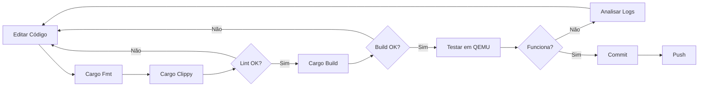

# Guia de Desenvolvimento - Ignite Bootloader

## 📋 Índice

- [Configuração do Ambiente](#configuração-do-ambiente)
- [Compilação](#compilação)
- [Estrutura do Código](#estrutura-do-código)
- [Testes e Depuração](#testes-e-depuração)
- [Workflow de Desenvolvimento](#workflow-de-desenvolvimento)
- [Padrões de Código](#padrões-de-código)
- [Ferramentas e Utilidades](#ferramentas-e-utilidades)

---

## Configuração do Ambiente

### Requisitos de Sistema

#### Sistema Operacional
- **Linux**: Ubuntu 22.04+, Fedora 38+, Arch Linux (recomendado)
- **Windows**: Windows 10/11 com WSL2
- **macOS**: macOS 12+ (Monterey ou superior)

#### Hardware Mínimo
- **CPU**: x86_64 com suporte a virtualização (Intel VT-x / AMD-V)
- **RAM**: 8 GB (16 GB recomendado)
- **Disco**: 10 GB livres (SSD recomendado)

---

### Instalação do Rust

#### 1. Instalar Rust via rust up

```bash
# Instalar rustup (gerenciador de toolchains)
curl --proto '=https' --tlsv1.2 -sSf https://sh.rustup.rs | sh

# Adicionar ao PATH (ou reiniciar terminal)
source $HOME/.cargo/env

# Verificar instalação
rustc --version
cargo --version
```

#### 2. Configurar Rust Nightly

O Ignite usa recursos unstable do Rust, requerendo a toolchain nightly:

```bash
# Instalar nightly
rustup toolchain install nightly

# Definir nightly como padrão globalmente (opcional)
rustup default nightly

# OU usar nightly apenas neste projeto (recomendado)
# O arquivo rust-toolchain.toml já configura isso automaticamente
```

**Conteúdo de `rust-toolchain.toml`**:
```toml
[toolchain]
channel = "nightly"
components = ["rust-src", "rustfmt", "clippy", "llvm-tools-preview"]
targets = ["x86_64-unknown-uefi"]
profile = "minimal"
```

#### 3. Adicionar Target UEFI

```bash
# Adicionar target x86_64 UEFI
rustup target add x86_64-unknown-uefi --toolchain nightly

# Verificar
rustup target list --installed
```

---

### Ferramentas de Desenvolvimento

#### Essenciais

```bash
# Git (controle de versão)
sudo apt install git                    # Ubuntu/Debian
sudo dnf install git                    # Fedora
sudo pacman -S git                      # Arch Linux

# Build tools
sudo apt install build-essential        # Ubuntu/Debian
sudo dnf groupinstall "Development Tools"  # Fedora
sudo pacman -S base-devel               # Arch Linux
```

#### QEMU (Emulação)

```bash
# QEMU com suporte UEFI
sudo apt install qemu-system-x86 ovmf   # Ubuntu/Debian
sudo dnf install qemu-system-x86 edk2-ovmf  # Fedora
sudo pacman -S qemu-full ovmf           # Arch Linux

# Verificar
qemu-system-x86_64 --version
```

#### GDB (Debugging)

```bash
# GDB para depuração
sudo apt install gdb                    # Ubuntu/Debian
sudo dnf install gdb                    # Fedora
sudo pacman -S gdb                      # Arch Linux

# GDB com suporte EFI (opcional)
sudo apt install gdb-multiarch          # Ubuntu/Debian
```

#### Ferramentas Opcionais

```bash
# mtools (manipular imagens FAT)
sudo apt install mtools

# dosfstools (criar filesystems FAT32)
sudo apt install dosfstools

# parted (particionar discos)
sudo apt install parted

# rr (record & replay debugger)
sudo apt install rr                     # Excelente para debugging determinístico
```

---

### Clone do Repositório

```bash
# Clone via HTTPS
git clone https://github.com/redstone-os/ignite.git
cd ignite

# OU via SSH (se configurado)
git clone git@github.com:redstone-os/ignite.git
cd ignite

# Verificar estrutura
tree -L 2 .
```

---

### Configuração do Editor

#### Visual Studio Code

**Extensões Recomendadas**:

```json
{
  "recommendations": [
    "rust-lang.rust-analyzer",      // IntelliSense para Rust
    "tamasfe.even-better-toml",     // Syntax highlighting para TOML
    "vadimcn.vscode-lldb",          // Debugger
    "serayuzgur.crates",            // Gerenciar dependências
    "dustypomerleau.rust-syntax"    // Melhor syntax highlighting
  ]
}
```

**Configuração (`.vscode/settings.json`)**:

```json
{
  "rust-analyzer.cargo.target": "x86_64-unknown-uefi",
  "rust-analyzer.checkOnSave.allTargets": false,
  "rust-analyzer.cargo.features": [],
  "files.trimTrailingWhitespace": true,
  "editor.formatOnSave": true,
  "[rust]": {
    "editor.defaultFormatter": "rust-lang.rust-analyzer"
  }
}
```

#### Vim/Neovim

```vim
" Instalar rust.vim
Plug 'rust-lang/rust.vim'

" Instalar coc-rust-analyzer
:CocInstall coc-rust-analyzer

" Configuração
let g:rustfmt_autosave = 1
let g:rust_clip_command = 'xclip -selection clipboard'
```

---

## Compilação

### Build Básico

#### Debug Build (Desenvolvimento)

```bash
# Compilar em modo debug
cargo build --target x86_64-unknown-uefi

# Binário gerado em:
# target/x86_64-unknown-uefi/debug/ignite.efi
```

**Características**:
- ✅ Símbolos de debug incluídos
- ✅ Assertions habilitadas
- ✅ Otimização mínima (-Og)
- ❌ Binário grande (~800 KB)
- ❌ Mais lento em runtime

#### Release Build (Produção)

```bash
# Compilar em modo release
cargo build --release --target x86_64-unknown-uefi

# Binário gerado em:
# target/x86_64-unknown-uefi/release/ignite.efi
```

**Características**:
- ✅ Otimizado para tamanho (`opt-level = "z"`)
- ✅ LTO (Link Time Optimization)
- ✅ Binário compacto (~200-300 KB)
- ✅ Stripped (sem símbolos)
- ❌ Mais difícil de debugar

---

### Perfis de Compilação

Configurados em `Cargo.toml`:

```toml
[profile.dev]
panic = "abort"           # Sem unwinding (reduz tamanho)
opt-level = 0             # Sem otimização

[profile.release]
panic = "abort"
lto = true                # Link Time Optimization
codegen-units = 1         # Melhor otimização (mais lento para compilar)
opt-level = "z"           # Otimizar para tamanho
strip = true              # Remover símbolos de debug
```

---

### Compilação Customizada

#### Ativar Features Opcionais

```bash
# Compilar com alocador de biblioteca (para testes unitários)
cargo build --target x86_64-unknown-uefi --features lib_allocator
```

#### Verbose Output

```bash
# Ver comandos exatos executados
cargo build --target x86_64-unknown-uefi -vv

# Mostrar warnings
cargo build --target x86_64-unknown-uefi -- -W warnings
```

#### Cross-compilation (futuro)

```bash
# ARM64 (quando suportado)
cargo build --target aarch64-unknown-uefi

# RISC-V 64 (quando suportado)
cargo build --target riscv64gc-unknown-uefi
```

---

### Verificações de Qualidade

#### rustfmt (Formatação)

```bash
# Formatar todo o código
cargo fmt

# Verificar sem modificar
cargo fmt -- --check

# Formatar com configuração específica (rustfmt.toml)
cargo fmt --all
```

#### Clippy (Linting)

```bash
# Executar clippy
cargo clippy --target x86_64-unknown-uefi

# Clippy com warnings como erros
cargo clippy --target x86_64-unknown-uefi -- -D warnings

# Clippy com pedantic lints
cargo clippy --target x86_64-unknown-uefi -- -W clippy::pedantic
```

**Configuração (`.clippy.toml`)**:
```toml
# Nível de lint
cognitive-complexity-threshold = 30
too-many-arguments-threshold = 8

# Permitir alguns lints
allow = [
    "clippy::missing_safety_doc",      # unsafe está documentado contextualmente
    "clippy::upper_case_acronyms",     # UEFI, GOP, etc são nomes padrão
]
```

---

### Build Automatizado

#### Script de Build

Criar `build.sh`:

```bash
#!/bin/bash
set -e

echo "🔨 Building Ignite Bootloader..."

# Limpar builds antigas
cargo clean

# Formatar código
echo "📝 Formatting code..."
cargo fmt --all

# Lint
echo "🔍 Running clippy..."
cargo clippy --target x86_64-unknown-uefi -- -D warnings

# Build release
echo "🚀 Building release..."
cargo build --release --target x86_64-unknown-uefi

# Copiar para dist/
echo "📦 Copying to dist/..."
mkdir -p dist
cp target/x86_64-unknown-uefi/release/ignite.efi dist/BOOTX64.EFI

# Tamanho do binário
SIZE=$(ls -lh dist/BOOTX64.EFI | awk '{print $5}')
echo "✅ Build complete! Binary size: $SIZE"
```

```bash
chmod +x build.sh
./build.sh
```

---

## Estrutura do Código

### Organização de Arquivos

```
ignite/
├── Cargo.toml              # Manifesto do projeto
├── Cargo.lock              # Lock de dependências
├── rust-toolchain.toml     # Configuração da toolchain
├── rustfmt.toml            # Regras de formatação
├── .clippy.toml            # Configuração do Clippy
├── .editorconfig           # Configuração de editor
├── .gitignore              # Arquivos ignorados pelo Git
├── .gitattributes          # Atributos do Git
├── LICENSE                 # Licença MIT
├── README.md               # Documentação principal
│
├── src/                    # Código-fonte
│   ├── main.rs            # Entry point (efi_main)
│   ├── lib.rs             # Biblioteca central
│   ├── panic.rs           # Panic handler
│   │
│   ├── arch/              # Abstração de arquitetura
│   ├── config/            # Sistema de configuração
│   ├── core/              # Tipos centrais
│   ├── elf/               # Parser ELF
│   ├── fs/                # Sistemas de arquivos
│   ├── hardware/          # Drivers de hardware
│   ├── memory/            # Gerenciamento de memória
│   ├── os/                # Abstração de OS
│   ├── protos/            # Protocolos de boot
│   ├── recovery/          # Diagnósticos
│   ├── security/          # Segurança
│   ├── uefi/              # Interface UEFI
│   ├── ui/                # Interface de usuário
│   └── video/             # Subsistema de vídeo
│
├── docs/                   # Documentação técnica
│   ├── ARQUITETURA.md
│   ├── DESENVOLVIMENTO.md
│   ├── API.md
│   └── ...
│
├── tests/                  # Testes de integração
│   └── integration_test.rs
│
└── tools/                  # Scripts e ferramentas
    ├── create_image.sh    # Criar imagem bootável
    └── run_qemu.sh        # Executar em QEMU
```

---

### Convenções de Nomenclatura

#### Arquivos e Módulos

- **Módulos**: `snake_case` (ex: `memory_allocator.rs`)
- **Diretórios**: `snake_case` (ex: `file_systems/`)

#### Código Rust

```rust
// Structs, Enums, Traits: PascalCase
pub struct BootConfig { }
pub enum ProtocolType { }
pub trait FileSystem { }

// Funções, variáveis: snake_case
pub fn load_configuration() { }
let kernel_data = read_file();

// Constantes, estáticas: SCREAMING_SNAKE_CASE
pub const MAX_ENTRIES: usize = 16;
static SYSTEM_TABLE: Once<SystemTable> = Once::new();

// Tipos genéricos: single uppercase letter ou PascalCase
pub fn allocate<T>(count: usize) -> Result<T>
pub fn map_kernel<Alloc: FrameAllocator>(allocator: &mut Alloc)
```

---

### Documentação Inline

#### Comentários de Documentação

```rust
/// Carrega a configuração do bootloader a partir do disco.
///
/// # Argumentos
///
/// * `fs` - Sistema de arquivos para ler o arquivo de configuração
///
/// # Retorna
///
/// * `Ok(BootConfig)` - Configuração carregada com sucesso
/// * `Err(BootError)` - Erro ao ler ou parsear a configuração
///
/// # Exemplos
///
/// ```no_run
/// # use ignite::fs::UefiFileSystem;
/// # use ignite::config::loader::load_configuration;
/// let mut fs = UefiFileSystem::new(proto);
/// let config = load_configuration(&mut fs)?;
/// ```
///
/// # Panics
///
/// Esta função não entra em pânico.
///
/// # Safety
///
/// N/A (função totalmente segura)
pub fn load_configuration(fs: &mut dyn FileSystem) -> Result<BootConfig> {
    // Implementação...
}
```

#### Comentários de Implementação

```rust
// FIXME: Implementar validação de checksum
// TODO: Adicionar suporte a múltiplos arquivos de configuração
// HACK: Workaround temporário para firmware bugado
// NOTE: Este código assume que a memória está zerada
// SAFETY: Ponteiro garantido válido pelo firmware UEFI
```

---

## Testes e Depuração

### Testes Unitários

#### Limitações

Testes unitários convencionais (`#[test]`) **não funcionam** diretamente em `no_std`:

```rust
// NÃO FUNCIONA EM no_std
#[test]
fn test_parser() {
    assert_eq!(parse("test"), Ok(Config));
}
```

**Motivo**: Test runner do Rust depende de `std`.

#### Solução: Testes Condi cionais

```rust
#[cfg(all(test, not(target_os = "uefi")))]
mod tests {
    use super::*;
    
    #[test]
    fn test_protocol_detection() {
        // Testar apenas lógica pura
        let proto = Protocol::from("linux");
        assert_eq!(proto, Protocol::Linux);
    }
}
```

Compilar testes:

```bash
# Executar testes no host (não no target UEFI)
cargo test --lib
```

---

### Depuração com Logs Serial

#### Ativar Serial no QEMU

```bash
qemu-system-x86_64 \
  -serial stdio \          # Serial output para console
  -bios OVMF.fd \
  -drive file=disk.img,format=raw
```

#### Usar macros de log

```rust
use ignite::println;

fn some_function() {
    println!("Debug: Entrando na função");
    println!("Valor de x: {:#x}", x);
    println!("Estado: {:?}", state);
}
```

**Saída Esperada**:
```
Debug: Entrando na função
Valor de x: 0x1234
Estado: BootState::Initializing
```

---

### Depuração com GDB

#### Preparar QEMU para GDB

```bash
qemu-system-x86_64 \
  -s \                     # Habilitar gdbserver na porta 1234
  -S \                     # Pausar na inicialização
  -serial stdio \
  -bios OVMF.fd \
  -drive file=disk.img,format=raw
```

#### Conectar GDB

```bash
# Em outro terminal
gdb target/x86_64-unknown-uefi/debug/ignite.efi

# Dentro do GDB
(gdb) target remote :1234           # Conectar ao QEMU
(gdb) break efi_main                # Breakpoint no entry point
(gdb) continue                      # Continuar execução

# Comandos úteis
(gdb) info registers                # Ver registradores
(gdb) x/16gx $rsp                   # Examinar stack
(gdb) backtrace                     # Stack trace
(gdb) print variable_name           # Imprimir variável
(gdb) step                          # Step into
(gdb) next                          # Step over
```

#### GDB com Símbolos

Para debug symbols funcionarem:

1. Build sem `strip`:

```toml
# Cargo.toml
[profile.dev]
panic = "abort"
strip = false              # Manter símbolos
```

2. Carregar símbolos no GDB:

```gdb
(gdb) symbol-file target/x86_64-unknown-uefi/debug/ignite.efi
```

---

### Debugging em Hardware Real

#### Preparar USB Bootável

```bash
# Criar imagem
dd if=/dev/zero of=usb.img bs=1M count=128
parted usb.img mklabel gpt
parted usb.img mkpart primary fat32 1MiB 100%
parted usb.img set 1 esp on

# Montar e copiar
sudo losetup -fP usb.img
sudo mkfs.vfat -F32 /dev/loop0p1
sudo mount /dev/loop0p1 /mnt
sudo mkdir -p /mnt/EFI/BOOT
sudo cp target/x86_64-unknown-uefi/release/ignite.efi /mnt/EFI/BOOT/BOOTX64.EFI
sudo umount /mnt
sudo losetup -d /dev/loop0

# Gravar em USB físico
sudo dd if=usb.img of=/dev/sdX bs=4M status=progress
```

#### Capturar Logs Serial

**Hardware necessário**: Cabo serial USB-TTL

```bash
# Conectar ao COM1 do hardware
screen /dev/ttyUSB0 115200

# OU
minicom -D /dev/ttyUSB0 -b 115200
```

---

## Workflow de Desenvolvimento

### Ciclo de Desenvolvimento



### Branches e Commits

#### Estratégia de Branching

```
main (stable)
  ├── develop (integração)
  │   ├── feature/multiboot2-support
  │   ├── feature/arm64-port
  │   └── bugfix/serial-output
  └── hotfix/critical-security-fix
```

#### Mensagens de Commit

Seguir [Conventional Commits](https://www.conventionalcommits.org/):

```
tipo(escopo): descrição curta

Descrição detalhada do que foi feito e por quê.

BREAKING CHANGE: descrição de mudanças incompatíveis
```

**Tipos**:
- `feat`: Nova funcionalidade
- `fix`: Correção de bug
- `docs`: Documentação
- `style`: Formatação
- `refactor`: Refatoração
- `perf`: Melhoria de performance
- `test`: Testes
- `chore`: Manutenção

**Exemplos**:

```bash
git commit -m "feat(protos): add Multiboot2 protocol support"
git commit -m "fix(memory): correct page table alignment check"
git commit -m "docs(api): document FrameAllocator trait"
git commit -m "refactor(uefi): simplify BootServices wrapper"
```

---

### Code Review

#### Checklist do Reviewer

- [ ] Código compila sem warnings
- [ ] Clippy passa sem erros
- [ ] Código está formatado (rustfmt)
- [ ] Documentação inline atualizada
- [ ] Testes passam (se aplicável)
- [ ] Sem unsafe desnecessário
- [ ] Performance considerada
- [ ] Compatibilidade mantida

---

## Padrões de Código

### Error Handling

```rust
// BOM: Result com tipo customizado
pub fn load_kernel(path: &str) -> Result<Vec<u8>> {
    let file = fs::open(path)?;
    let data = fs::read(file)?;
    Ok(data)
}

// RUIM: panic! em biblioteca
pub fn load_kernel(path: &str) -> Vec<u8> {
    let file = fs::open(path).expect("arquivo não encontrado"); // ❌
    // ...
}
```

### Unsafe

```rust
// BOM: Documentar SAFETY
/// # Safety
/// Este código assume que `ptr` aponta para memória válida e alinhada.
/// O caller deve garantir que a memória não seja acessada concorrentemente.
unsafe fn write_register(ptr: *mut u32, value: u32) {
    core::ptr::write_volatile(ptr, value);
}

// RUIM: unsafe sem justificativa
unsafe fn do_something() {  // ❌ Por que unsafe?
    // ...
}
```

### Ownership e Borrowing

```rust
// BOM: Borrowing explícito
fn process_config(config: &BootConfig) {
    // Apenas leitura
}

fn modify_config(config: &mut BootConfig) {
    // Modificação
}

fn consume_config(config: BootConfig) {
    // Move ownership
}

// RUIM: Clone desnecessário
fn process_config(config: BootConfig) {  // ❌ Desnecessário
    let _ = config.clone();
}
```

---

## Ferramentas e Utilidades

### cargo-binutils

```bash
# Instalar
cargo install cargo-binutils
rustup component add llvm-tools-preview

# Ver seções do binário
cargo objdump --target x86_64-unknown-uefi --release -- -h

# Ver símbolos
cargo nm --target x86_64-unknown-uefi --release

# Disassembly
cargo objdump --target x86_64-unknown-uefi --release -- -d
```

### cargo-bloat

```bash
# Instalar
cargo install cargo-bloat

# Analisar tamanho do binário
cargo bloat --target x86_64-unknown-uefi --release
```

**Output exemplo**:
```
File  .text     Size Crate
  0.9%   5.2%  15.5KiB ignite efi_main
  0.7%   4.1%  12.2KiB goblin elf::parse
  ...
```

### cargo-expand

```bash
# Instalar
cargo install cargo-expand

# Expandir macros
cargo expand --target x86_64-unknown-uefi > expanded.rs
```

---

**Última Atualização**: 2025-12-21  
**Versão do Documento**: 1.0  
**Mantenedor**: Redstone OS Team
